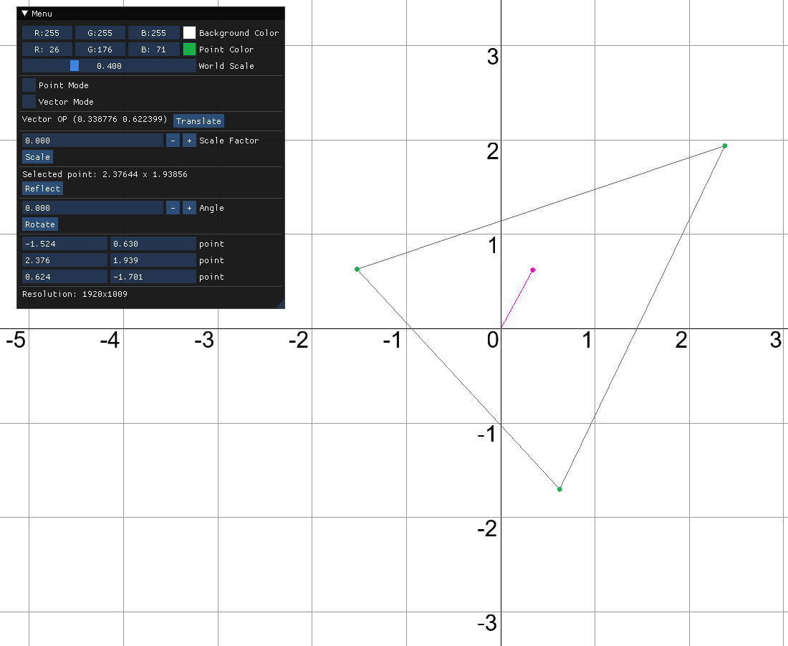
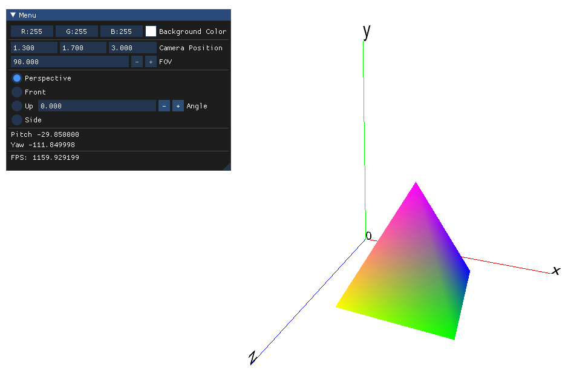
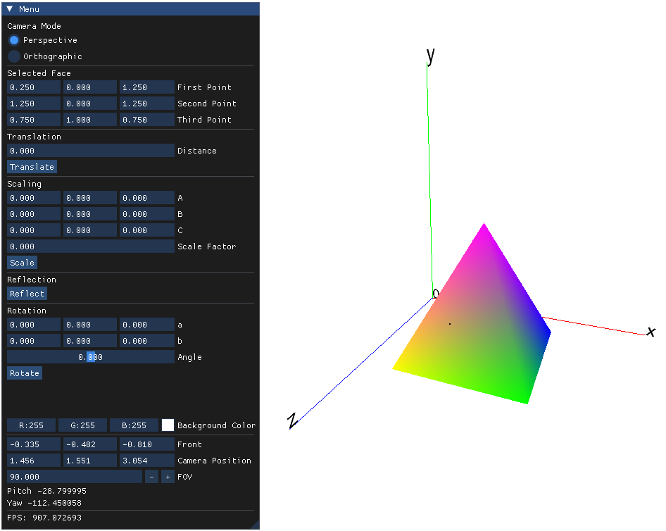

# Computer graphics
Computer Graphics lab work will be posted in this repository.

## System requirements
- Cmake 3.25+
- OpenGL 4.6
- Windows 10, 11 (other OS have not been tested)

## Installation
1. git clone --recurse-submodules https://github.com/mako1601/Computer-graphics.git
2. cd "Computer-graphics/lab 2"
3. mkdir build
4. cd build
5. cmake ..
6. repeat 2-5 to create other labs

## Task
### Second lab*
Implement transformations of a figure on a plane:
- transfer along the vector OP
- scaling along vector OP
- reflection relative to a given vertex of the shape
- rrotation around a given vertex of the shape

\* – I decided not to post the first work, the functions used for it are in [DrawFuntions](
https://github.com/mako1601/Computer-graphics/blob/master/lab%202/src/DrawFuntions.h).

### Third lab
Create a parallel oblique projection onto a plane parallel to Oxy. 
User can switch between top view, front view, right view and visual projection.

### Fourth lab
Implement shape transformations in space:
- translation perpendicular to a specific face of the polyhedron
- scaling perpendicular to a specific plane
- reflection relative to a given face of the polyhedron
- rotation around an arbitrary line in space
